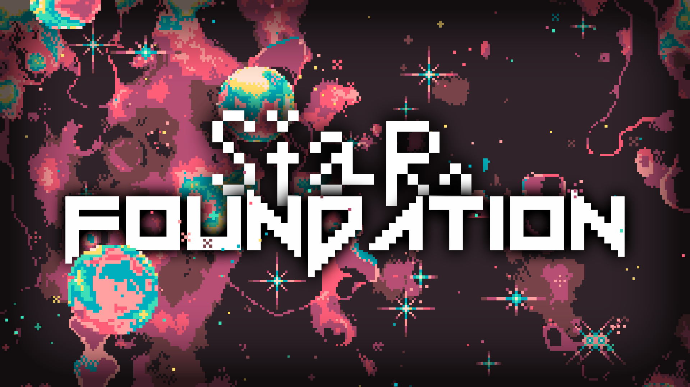

# <p align="center">Star Foundation</p>



## What is Star Foundation ?

Star Foundation is an RPG game in CLI made with Ruby.
<br>
This is based on the principle of books where you are the hero.

## How to play ?

Firstly you need to download the game using the instructions below, then read the readme [How To Play ?](how_to_play.md)
explaining how the game works.

**_Download ruby on your machine by using Homebrew :_**

(The version of Ruby for this project is 3.1.4)

```
brew install ruby
```

Else, if you are on Windows, you can install it here : https://rubyinstaller.org/

**_Download all the dependencies_**

```
bundler install
```

**_Launch the game in a terminal_**

```
ruby main.rb
```
